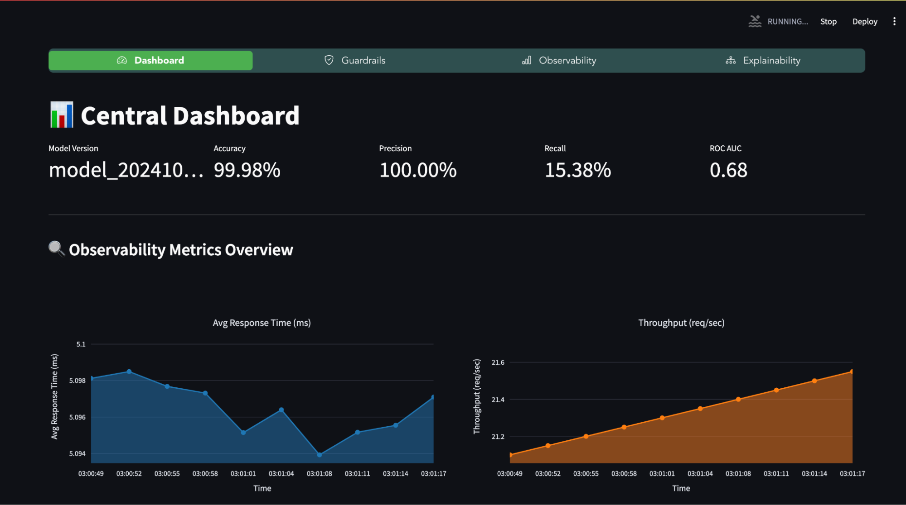
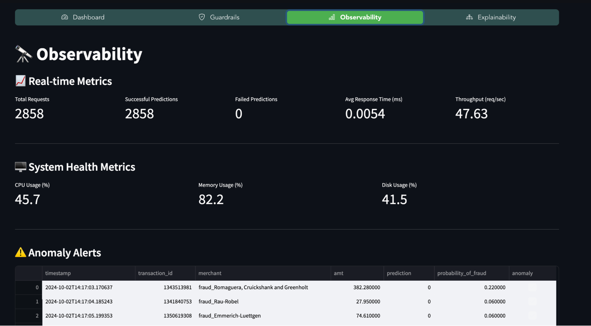
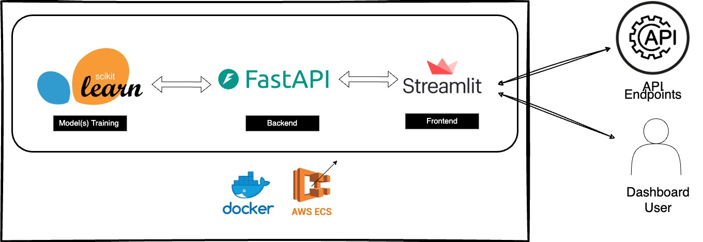

# MLOps Platform for Credit Card Fraud Detection

A comprehensive MLOps platform designed for deploying, monitoring, and maintaining machine learning models for credit card fraud detection.

### Tech Stack
- **Model Training**: Scikit-learn
- **Backend**: FastAPI
- **Frontend**: Streamlit
- **Containerization**: Docker
- **Cloud Deployment**: AWS ECS

### Features

1. **Central Dashboard**  
   The dashboard provides real-time monitoring of key model metrics such as accuracy, precision, recall, and ROC AUC.

   

2. **Guardrails**  
   Monitor and manage model performance with guardrails, including:
   - Data Drift Detection
   - Performance Alerts
   - Model Version Control

3. **Observability**  
   Keep track of real-time metrics such as:
   - Total Requests
   - Successful Predictions
   - Average Response Time
   - System Health Metrics (CPU, Memory, Disk Usage)

   


4. **Explainability**  
   Visual insights into model decision-making using SHAP, allowing easy interpretation for both technical and non-technical stakeholders.

5. **System Architecture**  
   The platform follows a modular design with FastAPI, Streamlit, Docker, and AWS ECS integration for scalable deployment.

   

### What's Next?
- Integration with alerting systems (e.g., Slack, Email)
- Support for multiple models
- Retraining and hyperparameter tuning via the dashboard
- Cloud integration for seamless scaling
- Enhanced security and compliance features (e.g., HTTPS, user authentication)

### Getting Started

1. Clone the repo:
   ```bash
   git clone https://github.com/Frostbite-ai/natwest-Datathon-mlOps
   cd natwest-Datathon-mlOps
   ```

2. Install dependencies:
   ```bash
   pip install -r requirements.txt
   ```

3. Run the backend:
   ```bash
   uvicorn main:app --reload
   ```

4. Start the frontend:
   ```bash
   streamlit run app.py
   ```

5. Access the platform:
   Open your browser and navigate to `http://localhost:8501`
